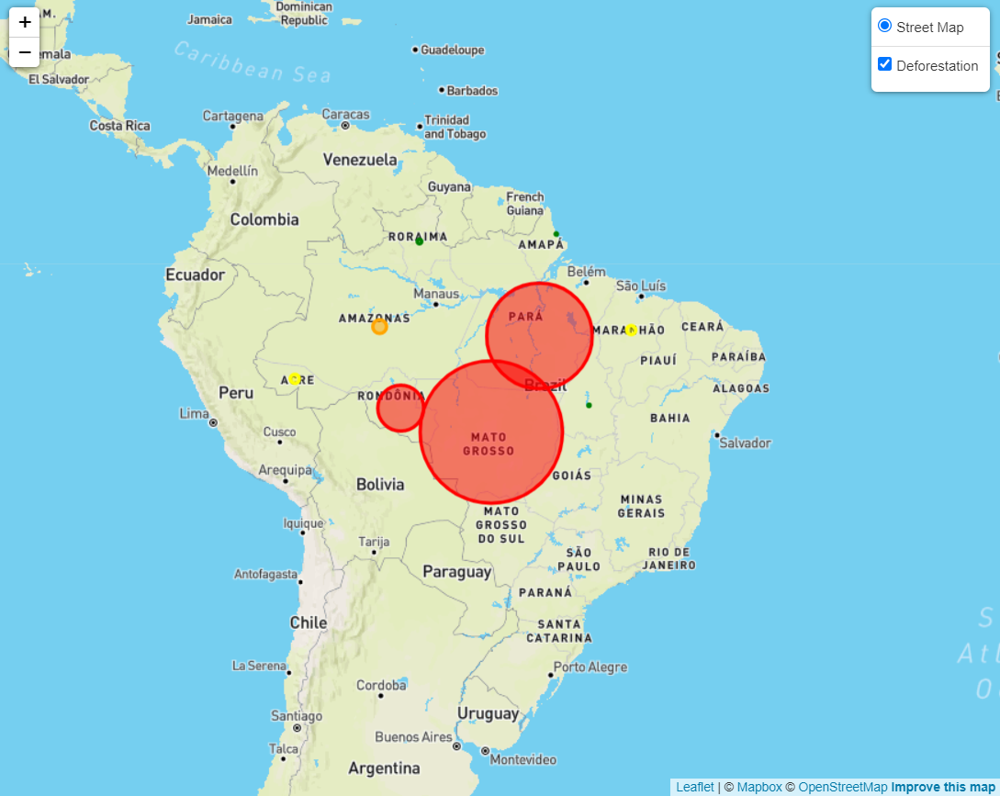
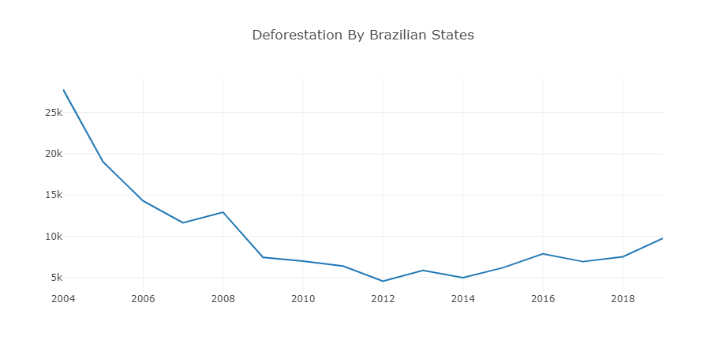

# Deforestation in the Amazon Rainforest 

---------------------

# Developer/Student Commentary
Within the repository you will find a group project that was originally submitted as part of the certification for the Data Science Bootcamp at Northwestern University.  I have since improved it significantly by adding a landing page, mapping page, and modifying the styling greatly. 

# Topic and Background
The exploration of this deforestation dataset was inspired by this [National Geographic Article]( https://www.nationalgeographic.com/environment/article/deforestation#:~:text=Between%201990%20and%202016%2C%20the,study%20in%20the%20journal%20Nature) by Christina Nunez.  

Between 1990 and 2016, the world lost 502,000 square miles (1.3 million square kilometers) of the forest. That is equivelant to an area larger than South Africa.   

The Amazon rainforest was selected for this project as it is the largest rainforest in the world.  The data used covers the time period from 2004-2019, which were critical years in the war against deforestation.  In 2003, the Brazilian government began regulating deforestation.  Initially, illegal deforestation decreased starkly as seen in the chart, however, after 2008 began to rise again in certain regions.  It is noted in the Geographic Article that at this time the government began to lower their gaurd and there is even speculation of crooked politics for profit at play.

# Dataset
Deforestation Dataset was taken from [Kaggle](https://www.kaggle.com/mbogernetto/brazilian-amazon-rainforest-degradation).

# Technical Details

* This project was built using a Flask app to connect to a MongoDB and deploy an API.  Python was used to program the Flask app and to explore the dataset in Jupyter Lab.  

* HTML, Bootstrap, and CSS were used to make the various webpages.  

* The interactive charts and maps were developed using JavaScript, Plotly, and Leaflet.js.

## Sample Map: Deforestation of the Year 2004 

## Sample Plot: Deforestation for AC State from 2004-2019

